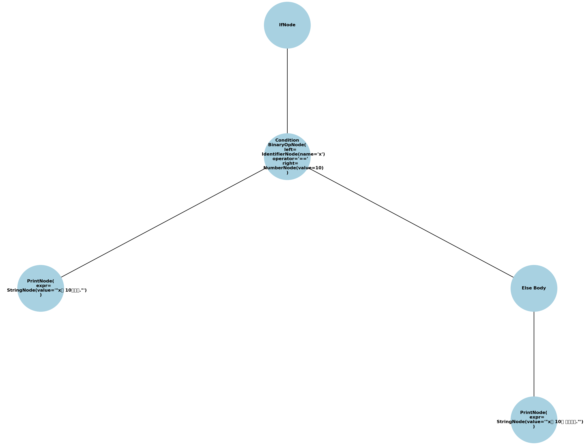

# HANA Programming Language Parser
by Ella Kim (yk3040) and Je Yang (jy3342)


## 1. Context-Free-Grammar
- `digit0`    : 0-9
- `digit`     : 1-9
- `letter`    : \u1100-\u11FF\u3130-\u318F\uAC00-\uD7AF | a-z | A-Z
- `otherchar` : |!”%&/()=+-*#><;,^.][\n \t
- `char`      : letter | otherchar | digit0

- `int`       : '0' | digit+digit0*
- `float`     : digit0+ '.' digit0+
- `num`       : ('-')?(float | int)
- `bool`      : 'True' | '진실' | 'False' | '거짓'
- `null`      : 'NULL' | '널'
- `var`       : letter ([[_digit0*] | [_letter]])*
- `qString`   : '"' (char)* '"'
- `commentLine`   : '#' (char)*

- `obj`       : var | num | qString | bool | null | list | listElem

- `list`      : '[' (listExpr)? ']'
- `listElem`  : var '[' int ']'
- `listExpr`  : obj (',' obj)*

- `operator`  : '+' | '-' | '*' | '**' | '/' | '%' | condition
- `condition` : '&&' | '||' | '!=' | '==' | '<=' | '>=' | '>' | '<'

- `assign`    : var '=' expr

- `expr`      : pred (condition expr)?
- `pred`      : term ( ('+' | '-') pred)?
- `term`      : baseExpr ( ('*' | '/' | '/.' | '%') term)?
- `baseExpr`  : obj | '(' expr ')'

### Function Definition and Control Structures
- `funcDef`   : '함수' var '(' (var (',' var)*)? ')' '{' funcBody '}'
- `funcBody`  : (line ENDLINE)* (returnLine ENDLINE)?
- `returnLine`: '반환' expr

- `ifLine`    : '만약에' ifCond '{' ifBody '}' (elsePart)?
- `ifCond`    : '(' expr ')'
- `ifBody`    : line (ENDLINE line)*

- `elsePart`  : '아니면' '{' line (ENDLINE line)* '}'

- `loopLine`  : '동안에' loopCond '{' loopBody '}'
- `loopCond`  : '(' expr ')'
- `loopBody`  : line (ENDLINE line)*

### Statements and Lines
- `line`      : assign | funcCall | ifLine | loopLine | breakLine | contLine | outputLine | cString
- `funcCall`  : var '(' (expr (',' expr)*)? ')'
- `breakLine` : 'break'
- `contLine`  : 'continue'
- `outputLine`: '출력' '(' qString (',' expr)* ')'

### Program
- `program`   : (funcDef | line | commentLine)*


## 2. Recursive Descent Parsing
The HANA parser uses **Recursive Descent Parsing** as a parsing algorithm. 
### 1. Tokenization
`lexer_2.py` tokenizes the input source file and into token type like keywords, identifiers, literals, operators, etc. 
Comments are ignored during this process.

### 2. Parsing Functions
The HANA parser iterates `parse()` over all tokens, delegating the actual parsing to more specific functions. The parser employs recursive descent, meaning that each type of expression or statement can call other parsing functions as needed. For example,
- Function Calls: Recursive descent occurs in functions like `parse_func_call()`, where arguments are recursively parsed using `parse_expr()`. This allows the parser to handle nested function calls or expressions as arguments, supporting complex program structures.

- Conditional Statements: The `parse_if()` function calls `parse_expr()` to handle the condition, and then recursively processes the body of the if statement. Similarly, `parse_while()` processes while loop conditions and bodies recursively.
Note that comment (#) is ignored during the parsing.

### 3. AST Construction
Each parsed element is represented as a node in the AST defined in `ast_node.py`. The nodes include FuncDefNode, BinaryOpNode, AssignNode, etc., each representing different elements of the tokens. 


## 3. Error Handling
The HANA parser handles the error with **panic mode**.
### 1. Expectation Mismatch
The HANA parser uses `expect()` function to check whether the current token matches what is expected (e.g., an operator, a delimiter, etc.). If there is a mismatch, it raises a SyntaxError with a descriptive message indicating what was expected versus what was found.

### 2. Error Nodes in AST
The HANA parser adds `ErrorNode` to the AST where the error is detected. The ErrorNode includes information about the error message and the expected context, providing context within the visualized AST. 

### 3. Syntatic Error Example
- Unterminated string: "String should opend and closed with "
- Unmatched delimiter: [ } or function opened with [ ]
- Invalid number: 5..5 or 5.


## 4. Sample Input Programs and Expected Outputs
### Take a look into our [demo video](https://youtu.be/yiyRi3v4ZIM) !!
### Sample 1
**Input file**
```
x = 10                                                // x = 10
출력(x)                                                // print(x)
```
**Output AST**

Parser Output:


Visualizer:


### Sample 2
**Input file**
```
만약에 x == 10{                                         // if (x == 10){
    출력("x는 10입니다.")                                 //    print("x is equal ot 10")
}                                                      // }
아니면{                                                 // else {
    출력("x는 10이 아닙니다.")                             //   print("x is not equal to 10")
}                                                      // }
```
**Output AST**

Parser Output: 


Visualizer: 



### Sample 3
**Input file**
```
딕셔너리 연산기 = {}                                    // dictionary arithmetic = {}

함수 더하기(x, y){                                     // function addition(x, y){
    연산기[x] = x + y                                 //    arithmetic[x] = x + y
}                                                   // }
함수 빼기 (x, y)[                                     // function subtraction(x, y)[
    반환 x - y                                       //     return x-y
]                                                   // ]
함수 지수(x, y){                                      // function power(x, y){
    반환 = x ** z                                    //    return x ** z
}                                                   // }
더하기(4, 5)                                          // addition(x, y)
지수(2, 6)                                           // power(2, 6)
출력(연산기.키())                                       // print(arithmetic.key())
```     
**Output AST**

Parser Output: 


Visualizer: 


### Sample 4
**Input file**
```
배열 아이디 = []                                         // list id = []

동안에 (아이디.길이() < 10){                              // while(len(id) < 10):
    원소 = 랜덤()                                       //    element = random()
    아이디.추가(원소)                                     //    id.append(element)
}                                                     //
아이디_원소_0 = 아이디.뽑기()                               // element_0 = id.pop()
3원소 = 아이디.뽑기(3)                                    // 3element = tmp_1_id.pop(3)
```
**Output AST**

Parser Output:


Visualizer:


### Sample 5
**Input file**
```
함수 피보나치(n) {                                              // function Fibonacci(n){
    만약에 n <= 1 {                                           //    if n <= 1 {
        반환 n                                               //         return n
    } 아니면 {                                                //    } else {
        반환 피보나치(n - 1) + 피보나치(n - 2)                    //        return Fibonacci(n-1) + Fibonacci(n-2) 
    }                                                       //    }
}                                                           // }

함수 주요_함수() {                                              // function main_function(){
    결과 = 10                                                 //    result = 10
    한국어_123_변수 = 5.5                                       //    korean_123_variable = 5.5
    테스트_변수 = 진실                                           //    test_variable = True
    널_테스트 = 널                                              //    null_test = Null
                                                             //
    만약에 테스트_변수 == 진실 그리고 한국어_123 < 결과 {              //    if test_varaible == True and korean_123 < result {
        출력("조건이 참입니다!")                                  //        print("condition is True!")
    } 아니면 {                                                 //   } else {
        출력("조건이 거짓입니다.")                                 //       print("condition is False!")
    }                                                        //   }
                                                             //
    카운터 = 0                                                 //   counter = 0
    동안에 (카운터 < 5..5) {                                     //   while (counter < 5..5){
        출력(피보나치(카운터))                                    //       print(Fibonacci(counter))
        카운터 = 카운터 + 1                                     //       counter = counter + 1
    }                                                        //   }
                                                             //
    수학_결과 = (결과 * 한국어_123) % 3 + 2 - 1                   //    math_result = (result * korean_123) % 3 + 2 - 1 
    출력("수학 결과: ", 수학_결과)                                //    print("math result: ", math_result)
                                                            //
    # '이것은 주석입니다'                                        //     # 'This is comment'
    # -> 이것 또한 주석입니다'                                    //    # -> This is also comment'
    문자열_테스트 = "이것은 '문자열'입니다."                         //     string_test = "This is 'string'."
    출력(문자열_테스트)                                          //     print(string_test)
}                                                            // }
문자열_테스트 = "이것은 바뀐 문자열입니다.'                           // string_test = "This is the modified string'
```
**Output AST**

Parser Output:


Visualizer:


